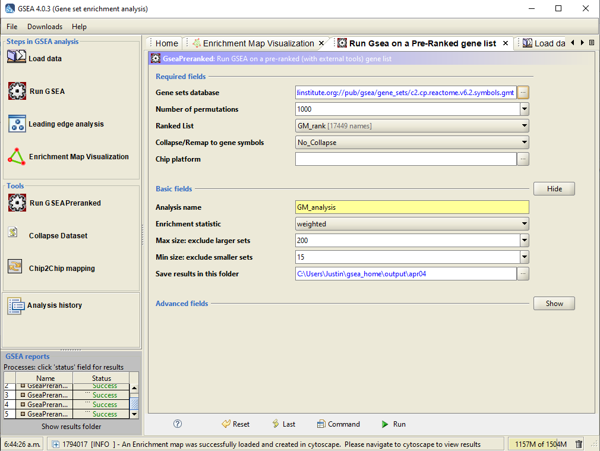
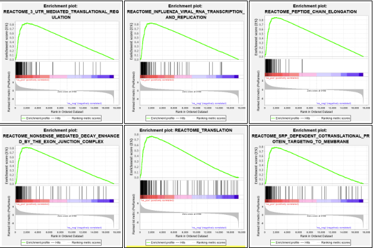
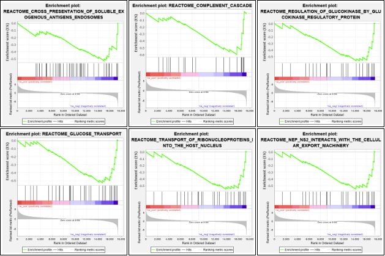
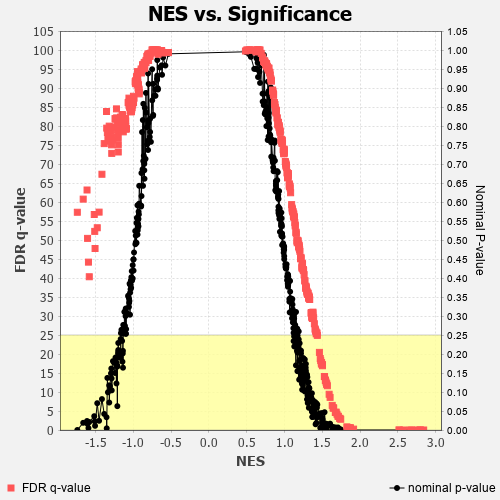
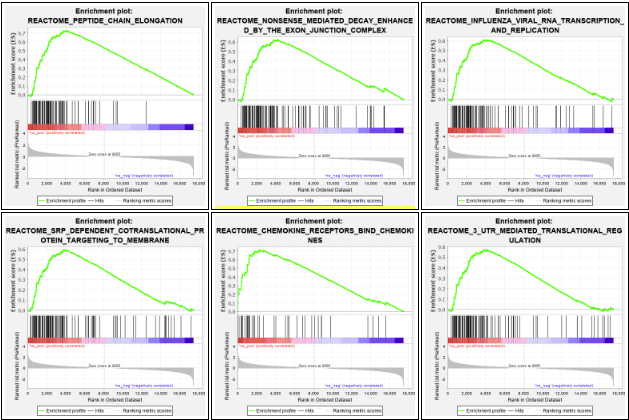
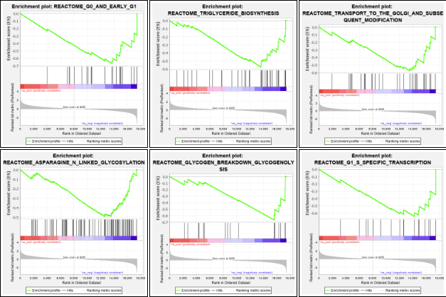
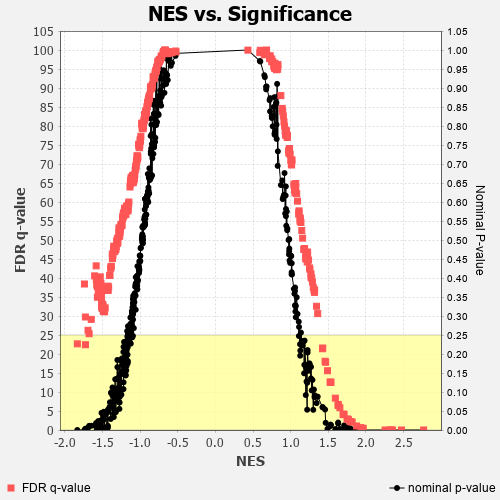
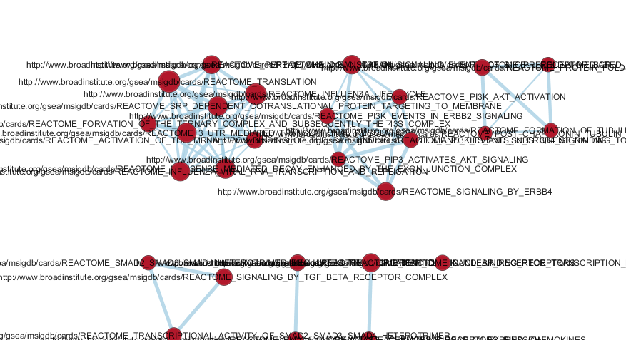
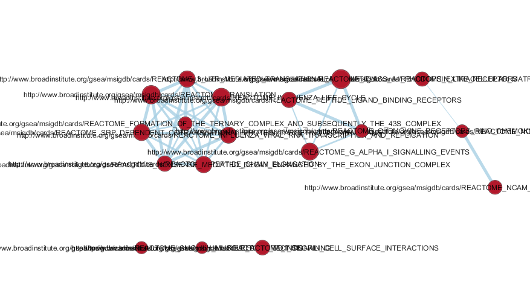

```{r setup, include=FALSE}
knitr::opts_chunk$set(echo = TRUE)

# loading required library if necessary
if (! requireNamespace("GEOquery", quietly = TRUE)) {
  BiocManager::install("GEOquery")
}

if (! requireNamespace("edgeR", quietly = TRUE)) {
  BiocManager::install("edgeR")
}

library(GEOquery)
library(knitr)
library(edgeR)

# downloading GEO dataset if necessary
if (!exists("GSE")) {
  GSE <- getGEO("GSE111972", GSEMatrix =FALSE)
}

# getting meta data
GPL <- names(GPLList(GSE))[1]
GPL_info <- Meta(getGEO(GPL))

# loading in supplementary data
sfiles <- getGEOSuppFiles('GSE111972')
fnames <- rownames(sfiles)
MS_exp <- read.delim(fnames[1],header=TRUE, check.names = FALSE)
rownames(MS_exp) <- MS_exp$ID

# filtering out lowly expressed genes
counts <- cpm(MS_exp[, 2:32])
rownames(counts) <- MS_exp$ID
strong_exp <- rowSums(counts > 1) >= 3
MS_exp_filter <- MS_exp[strong_exp, ]
MS_filter_matrix <- as.matrix(MS_exp_filter[, 2:32])

samples <- data.frame(
        lapply(colnames(MS_exp_filter)[2:32], 
        FUN=function(x){
          unlist(strsplit(x, split = "_"))[c(2, 3, 4)]}))
colnames(samples) <- colnames(MS_exp_filter)[2:32]
rownames(samples) <- c("condition","location", "patients")
samples <- data.frame(t(samples))
samples$cell_type <- paste(samples$condition, samples$location)

d = DGEList(counts=MS_filter_matrix, group=samples$cell_type)

# creating the model
model_design_pat <- model.matrix(~ samples$patients + samples$cell_type)

d <- estimateDisp(d, model_design_pat)
d <- calcNormFactors(d)

# fitting the model
fit <- glmQLFit(d, model_design_pat)

# calculating differential expression for white matter samples
qlf.pos_vs_neg_WM <- glmQLFTest(fit, coef='samples$cell_typeMS WM')
qlf.pos_vs_neg_GM <- glmQLFTest(fit, coef='samples$cell_typeMS GM')

# getting top results
qlf_output_hits_WM <- topTags(qlf.pos_vs_neg_WM, sort.by = "PValue",
                           n = nrow(MS_filter_matrix))
qlf_output_hits_GM <- topTags(qlf.pos_vs_neg_GM, sort.by = "PValue",
                           n = nrow(MS_filter_matrix))
# attaching gene names
qlf_output_hits_WM_gn <- merge(MS_exp[,1], qlf_output_hits_WM, by.x = 1, by.y = 0)
qlf_output_hits_GM_gn <- merge(MS_exp[,1], qlf_output_hits_GM, by.x = 1, by.y = 0)

# Computing and sorting by rank
qlf_output_hits_WM_gn[,"rank"] <- -log(qlf_output_hits_WM_gn$PValue,base =10) * sign(qlf_output_hits_WM_gn$logFC)
qlf_output_hits_WM_gn <- qlf_output_hits_WM_gn[order(qlf_output_hits_WM_gn$rank),]
qlf_output_hits_GM_gn[,"rank"] <- -log(qlf_output_hits_GM_gn$PValue,base =10) * sign(qlf_output_hits_GM_gn$logFC)
qlf_output_hits_GM_gn <- qlf_output_hits_GM_gn[order(qlf_output_hits_GM_gn$rank),]

```

## Dataset

**GEO ID:** GSE111972

**Dataset Name:** Transcriptional profiling of human microglia reveals grey-white matter heterogeneity and multiple sclerosis-associated changes

## Dataset Overview 

GEO dataset was downloaded during the setup of the page.

Previously I had the opportunity to work with RNAseq data from brain samples and it was very interesting to examine the different expression profiles between different cell types in the brain especially in a diseased state.  This dataset examines the expression profiles of both the grey matter and white matter of the human microglia in both healthy donors as well as donors with Multiple Sclerosis.

This data has been processed as seen in Assignment 1 and Assignment 2

```{r}

head(Meta(GSE))

```
**Title:** `r GPL_info$title`

**Technology:** `r GPL_info$technology`

**Submission Date:** `r GPL_info$submission_date`

**Last Update Date:** `r GPL_info$last_update_date`

**Organism:** `r GPL_info$organism`

**Number of GEO datasets that use this technology:** `r length(GPL_info$series_id)`

## Creating Rank files for GSEA

The processing used in Assignment 2 was used to create rank files for GSEA.

```{r}

# outputting rank files to use GSEA
write.table(x = qlf_output_hits_WM_gn[, c("x", "rank")],
            file = "WM_rank.rnk",sep = "\t",
            row.names = FALSE,col.names = FALSE,quote = FALSE)
write.table(x = qlf_output_hits_GM_gn[, c("x", "rank")],
            file = "GM_rank.rnk",sep = "\t",
            row.names = FALSE,col.names = FALSE,quote = FALSE)

```

## Running GSEA



This was done twice, once for the white matter expression data and once for the grey matter expression data.

**GSEA reports for white matter:**

```{r, echo=FALSE}

htmltools::includeHTML("WM_index.html")

```








**GSEA reports for grey matter:**

```{r, echo=FALSE}

htmltools::includeHTML("WM_index.html")

```








## Enrichment Map Visualization





These results appear to be in line with the conclusions of the original paper.
